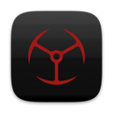

<p align="center">
  
</p>

<h1 align="center">Imperator DefaultBrowser</h1>

<p align="center">
  Switch the default web browser from the menu bar. Every installed browser gets its
  own row; click one and it takes over http and https.
</p>

## Requirements

Requires macOS 14 or later, Apple silicon. Built and tested on macOS 26 only — older versions are
expected to work but have not been verified.

Install at your own risk. The app is not notarized and carries no Apple Developer signature, so
macOS cannot vouch for it. It is provided as is, with no warranty, under the
[MIT license](LICENSE).

## Install

Download the latest zip from
[Releases](https://github.com/goranimperator/imperator-defaultbrowser-/releases), unzip, and move
`Imperator DefaultBrowser.app` to `/Applications`.

The app is signed with a self-signed certificate and is not notarized, so Gatekeeper blocks the
first launch. Right-click the app and choose **Open**, or clear the quarantine flag:

```bash
xattr -dr com.apple.quarantine "/Applications/Imperator DefaultBrowser.app"
```

There is no Dock icon. The app lives in the menu bar behind a globe glyph.

## Use

Click the globe in the menu bar. The popover lists every installed browser, one per row, with the
current default filled in brand red and marked with a checkmark. Click any other row and it becomes
the default browser for http and https. LaunchServices needs a couple of seconds to propagate the
change; the row updates straight away and the app verifies in the background.

**Settings** in the footer opens a window with two controls:

- **Scan for Browsers** — ask macOS again which browsers are installed, after installing or
  removing one.
- **Browser Order** — drag the rows into the order you want the menu bar list to use. **Reset
  Order** goes back to alphabetical. The order is saved to
  `~/Library/Application Support/ImperatorDefaultBrowser/order.json`.

## Permissions

None. The app requests no Accessibility, Input Monitoring, or Automation grants, and declares no
`NSUsage` keys. It asks LaunchServices which apps handle http and https, reads their bundles for
names and icons, and asks LaunchServices to change the handler.

## What counts as a browser

An app is listed when it handles **both** `http` and `https`, declares those schemes in its
`CFBundleURLTypes`, and lives in a real application directory: `/Applications`,
`/System/Applications`, `/System/Library/CoreServices`, `~/Applications`, or the Cryptex mount that
holds Safari on macOS 15 and later.

That last rule matters more than it sounds. LaunchServices also registers the throwaway browsers
that Playwright, Puppeteer and Selenium unpack into `~/Library/Caches` and `~/.cache`, and those
would otherwise show up as something to switch to.

## How the switch works

`NSWorkspace.setDefaultApplication(at:toOpenURLsWithScheme:)` is tried first, but on macOS 14 and
later it refuses to let one app hand the browser role to another and returns
`NSCocoaErrorDomain 256`, "The file couldn't be opened." So the app falls back to
`LSSetDefaultHandlerForURLScheme`, deprecated since macOS 12 and still the only call that moves the
role. Setting either scheme moves both. Either way the app confirms the result by re-reading the
default rather than trusting the return value, and surfaces an error in the popover if the change
never landed.

## Build

```bash
make install
```

Builds release with SPM, bundles as `.app`, codesigns with the self-signed `Imperator Dev` identity,
installs to `/Applications`, and launches. Other targets: `make run`, `make build`, `make clean`,
`make icon`.

## Verify

```bash
node /Users/goran/.claude/skills/unlazy/scripts/gate-check.mjs GATES.md
```

Runs the acceptance gates in [GATES.md](GATES.md): build, code signature, browser discovery,
default detection, ordering, brand book compliance, launch smoke test and app icon. The two manual
gates cover the live switch and the rendered UI.

The binary carries a few headless flags the checks use, and they are handy on their own:

```bash
.build/release/DefaultBrowser --list-browsers
.build/release/DefaultBrowser --list-handlers-raw
"build/Imperator DefaultBrowser.app/Contents/MacOS/DefaultBrowser" --set-default com.apple.Safari
open -n "build/Imperator DefaultBrowser.app" --args --settings
```

`--set-default` has to run from inside the signed bundle so LaunchServices sees a real app identity.

## Release

```bash
make dist VERSION=1.0.0
```

Builds a zip in `dist/`. Touches nothing in git or on the remote.

```bash
make release VERSION=1.0.0
```

Bumps `Resources/Info.plist`, commits, tags, pushes, and publishes a GitHub release with the zip
attached. Needs `gh` and a clean working tree.

## Third-party

The menu bar glyph is the `globe-check` icon from [Lucide](https://lucide.dev), used under the ISC
license. The attribution header in
[`GlobeIcon.swift`](Sources/DefaultBrowser/Services/GlobeIcon.swift) must stay.
